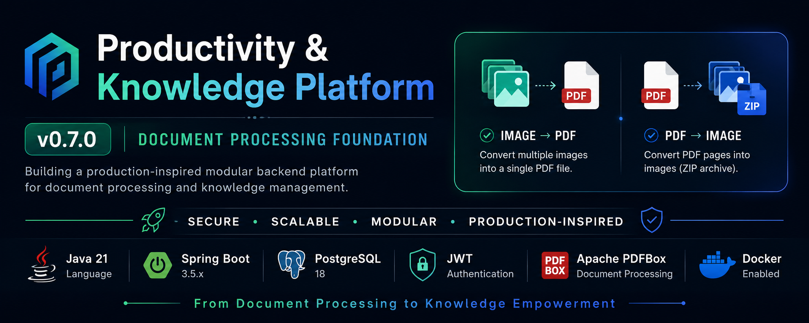
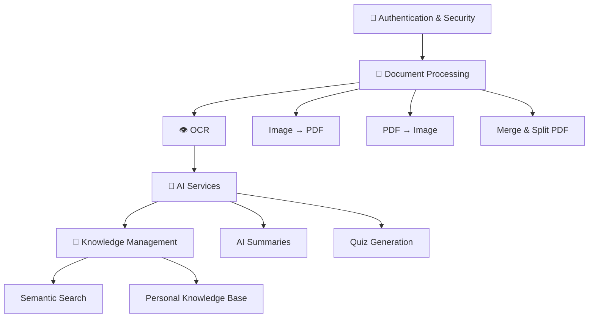
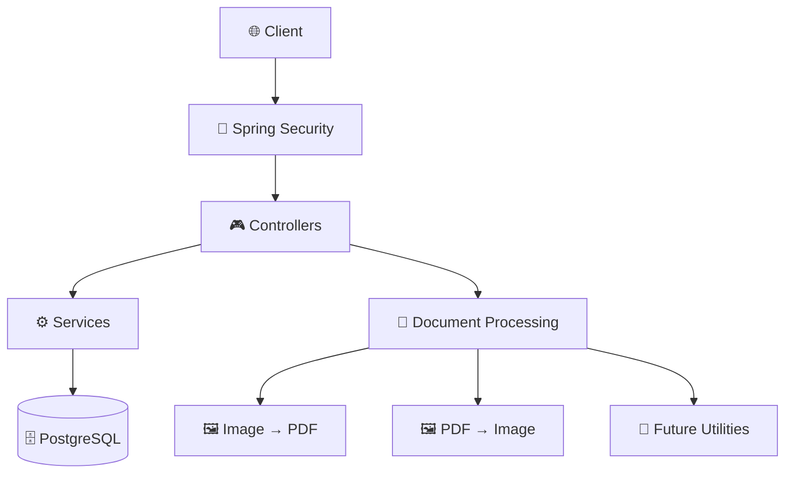
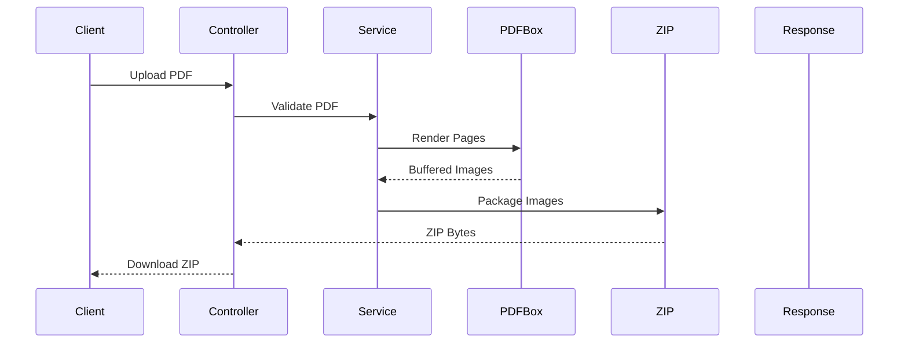

<p align="center">
    
</p>

<div align="center">

# 🚀 Productivity & Knowledge Platform

### **A Production-Inspired Modular Backend Platform Built with Spring Boot**

*Transforming practical document utilities into a scalable productivity and AI-powered knowledge management platform.*


<br>


</div>
<p align="center">
  <a href="#-getting-started">Getting Started</a> •
  <a href="#-current-features">Features</a> •
  <a href="#-architecture">Architecture</a> •
  <a href="#-engineering-documentation">Docs</a> •
  <a href="#-development-roadmap">Roadmap</a>
</p>

---

> [!NOTE]
> **Current Release:** **v0.7.0 — Document Processing Foundation**
> **Current Focus:** Building the **PDF → Image** utility while continuing to evolve the platform through production-inspired engineering practices.

---

## ⚡ Highlights

| 🚀 Feature | Description                                                   |
|------------|---------------------------------------------------------------|
| **Architecture** | Layered Modular Monolith designed for long-term scalability   |
| **Security** | Stateless JWT Authentication with Spring Security             |
| **Document Processing** | Image → PDF and PDF → Image powered by Apache PDFBox          |
| **Database** | PostgreSQL with Spring Data JPA                               |
| **Development** | Docker-based local development environment                    |
| **Documentation** | Comprehensive engineering documentation with ADRs and roadmap |
| **Current Release** | **v0.7.0 — Document Processing Foundation**                   |
| **Next Milestone** | PDF Utilities                                                 |

---

## 📚 Table of Contents

### 🚀 Introduction
> Learn what this project is, why it exists, and the long-term vision behind it.

- [📖 About the Project](#-about-the-project)
- [🌟 Why This Repository Is Different](#-why-this-repository-is-different)
- [🎯 Vision](#-vision)

---

### 🏗 Platform Overview
> Explore the current capabilities, architecture, and technologies powering the platform.

- [✨ Current Features](#-current-features)
- [📊 Project Status](#-project-status)
- [🏗️ Architecture](#️-architecture)
- [🛠️ Tech Stack](#️-tech-stack)
- [📂 Project Structure](#-project-structure)

---

### 🚀 Quick Start
> Get the project running on your local machine in just a few minutes.

- [🚀 Installation](#-getting-started)
- [📡 API Overview](#-api-overview)

---

### 📚 Project Resources
> Dive deeper into the engineering process and future roadmap.

- [📖 Engineering Documentation](#-engineering-documentation)
- [🛣️ Development Roadmap](#️-development-roadmap)

---

### ❤️ Community
> Interested in contributing or supporting the project?

- [🤝 Contributing](#-contributing)
- [📄 License](#-license)

---

## 📖 About the Project

Modern productivity platforms are more than a collection of isolated tools—they combine secure authentication, document processing, intelligent automation, and knowledge management into a unified ecosystem.

This project embraces that philosophy by building a **modular backend platform** that evolves through practical, production-inspired milestones.

Instead of implementing disconnected examples, every feature becomes part of a long-term system designed with scalability, maintainability, and clean architecture in mind.

The journey begins with secure authentication and a reusable Document Processing foundation. As the platform evolves, new capabilities such as PDF utilities, image processing, OCR, AI-assisted workflows, semantic search, and personal knowledge management will build upon this shared architecture rather than existing as isolated features.

The goal is not only to build software, but also to document the engineering decisions, trade-offs, and architectural evolution behind every milestone.

---

## 🌟 Why This Repository Is Different

Most Spring Boot learning projects focus on isolated topics such as CRUD operations, authentication, or file uploads.

This repository follows a different approach.

Rather than collecting unrelated examples, it documents the gradual evolution of a production-inspired backend platform.

Every milestone introduces new concepts only when they naturally fit the project's architecture and business goals.

Alongside the implementation, the repository maintains comprehensive engineering documentation, including:

- 🏗️ System Architecture
- 📘 Project Specification
- 📝 Architecture Decision Records (ADRs)
- 🛣️ Development Roadmap
- 📚 Engineering Learning Log
- 📖 Development Guide
- 🔄 Project Handoff Documentation

This allows readers to understand not only **what** was built, but also **why** each engineering decision was made.

---

## 🎯 Vision

The long-term goal is to evolve this repository into a complete **Productivity & Knowledge Platform**.



Every milestone expands the platform while preserving a clean, modular, and production-inspired architecture.

The focus is not on adding features quickly, but on introducing the **right level of complexity at the right time**.

---

# ✨ Current Features

The platform currently consists of two major areas:

- 🔐 Authentication & Security
- 📄 Document Processing

The Document Processing domain provides modular, reusable capabilities for converting and processing documents. New processing features are added incrementally while sharing a common architectural foundation.

## 🔐 Authentication & Security

| Feature | Status |
|---------|:------:|
| JWT Authentication | ✅ |
| Stateless Security | ✅ |
| Role-Based Authorization | ✅ |
| BCrypt Password Encryption | ✅ |
| Spring Security Integration | ✅ |
| Custom UserDetails | ✅ |
| AuthenticationManager | ✅ |
| Global Exception Handling | ✅ |
| Secure REST API Design | ✅ |

---

## 📄 Document Processing

###  Image → PDF

| Feature | Status |
|---------|:------:|
| Multiple Image Upload | ✅ |
| PNG Support | ✅ |
| JPEG Support | ✅ |
| Image Validation | ✅ |
| File Size Validation | ✅ |
| File Count Validation | ✅ |
| A4 Page Scaling | ✅ |
| Aspect Ratio Preservation | ✅ |
| Multi-page PDF Generation | ✅ |
| Apache PDFBox Integration | ✅ |
| Downloadable PDF Response | ✅ |
| In-Memory Processing | ✅ |

### PDF → Image

| Feature                   | Status |
| ------------------------- | :----: |
| PDF Validation            |    ✅   |
| Corrupted PDF Detection   |    ✅   |
| Multi-page PDF Rendering  |    ✅   |
| Page-to-Image Conversion  |    ✅   |
| ZIP Archive Generation    |    ✅   |
| Downloadable ZIP Response |    ✅   |
| Apache PDFBox Rendering   |    ✅   |
| In-Memory Processing      |    ✅   |

---

## 🏗 Engineering Practices

| Practice | Status |
|---------|:------:|
| Layered Architecture | ✅ |
| Feature-Oriented Organization | ✅ |
| DTO Pattern | ✅ |
| Constructor Injection | ✅ |
| Dependency Injection | ✅ |
| Docker Development | ✅ |
| PostgreSQL Integration | ✅ |
| Engineering Documentation | ✅ |
| Architecture Decision Records | ✅ |

---

# 📊 Project Status

### Current Development Progress

| Module                       |       Status      |
| ---------------------------- | :---------------: |
| 🚀 Project Foundation        |     ✅ Complete    |
| 🔐 Authentication & Security |     ✅ Complete    |
| 📄 Image → PDF               |     ✅ Complete    |
| 🖼 PDF → Image               |     ✅ Complete    |
| 📚 PDF Utilities             | 🚧 Next Milestone |
| 🖼 Image Utilities           |     ⏳ Planned     |
| 👁 OCR                       |     ⏳ Planned     |
| 🤖 AI Services               |     ⏳ Planned     |
| 🧠 Knowledge Platform        |     ⏳ Planned     |
| 🚀 Version 1.0               |     🎯 Target     |


---

### Current Release

**v0.7.0**

The project has successfully established the Document Processing Foundation by completing:

- Spring Boot Foundation
- Authentication & Security
- Image → PDF
- PDF → Image

The next development milestone focuses on expanding the PDF Processing capabilities while continuing to strengthen the platform's engineering quality.

---

# 🏗 Architecture

The project follows a **Layered Modular Monolith** architecture that emphasizes clear responsibilities, maintainability, and incremental growth.



### Request Lifecycle



### Engineering Principles

The architecture follows a few simple principles:

- Single Responsibility Principle
- Thin Controllers
- Business Logic in Services
- DTO-Based API Design
- Feature-Oriented Modularity
- Constructor Injection
- Centralized Exception Handling
- Simplicity Before Abstraction

As the platform grows, new capabilities will integrate into the existing architecture rather than introducing unnecessary complexity.

---

# 🛠 Tech Stack

| Category | Technologies |
|----------|--------------|
| ☕ **Backend** | Java 21, Spring Boot 3.5.x |
| 🔐 **Security** | Spring Security, JWT Authentication |
| 🗄 **Database** | PostgreSQL, Spring Data JPA, Hibernate |
| 📄 **Document Processing** | Apache PDFBox, ImageIO |
| 📦 **Build Tool** | Maven |
| 🐳 **DevOps** | Docker |
| 🧪 **API Testing** | Postman |
| 💻 **Version Control** | Git, GitHub |

---

### Why this stack?

The technologies were selected with three guiding principles:

- ✅ Production-ready
- ✅ Open Source
- ✅ Industry-standard

The project intentionally avoids unnecessary frameworks and focuses on mastering the Spring Boot ecosystem before introducing more advanced technologies.

---

# 📂 Project Structure

```text
productivity-platform/
│
├── 📂 assets/                 # README assets and screenshots
├── 📂 project_docs/           # Engineering documentation
├── 📂 src/
│   ├── main/
│   └── test/
│
├── 📄 README.md
├── 📄 CHANGELOG.md
├── 📄 LICENSE
├── 📄 pom.xml
└── 📄 docker-compose.yml
```

The repository separates implementation from engineering documentation.

- **src/** contains the application source code.
- **project_docs/** captures the architectural decisions, roadmap, and development guidelines.
- **assets/** stores images used by the README.

---

# 🚀 Getting Started
## 📋 Prerequisites

Before running the project, ensure you have the following installed:

- ☕ Java 21
- 📦 Maven (or use the included Maven Wrapper)
- 🐘 PostgreSQL

> [!NOTE]
> Docker is **currently used only for running the PostgreSQL database** during development.
>
> The Spring Boot application itself runs locally using Maven.

### 1️⃣ Clone the Repository

```bash
git clone https://github.com/Timely-Position463/productivity-platform.git
```

---

### 2️⃣ Navigate to the Project

```bash
cd productivity-platform
```

---

### 3️⃣ Start PostgreSQL (Optional)

```bash
docker compose up -d
```

This starts the PostgreSQL database using Docker.

> [!NOTE]
> If PostgreSQL is already installed and running on your machine, you can skip this step.

---

### 4️⃣ Configure the Application

Update the database credentials inside:

```text
src/main/resources/application.yml
```

---

### 5️⃣ Run the Application

Using Maven Wrapper

```bash
./mvnw spring-boot:run
```

or

```bash
mvn spring-boot:run
```

---

### 6️⃣ Access the Application

```text
http://localhost:8080
```

The application is now ready for API testing using Postman or any REST client.

---

# 📡 API Overview

## 🔐 Authentication

| Method | Endpoint | Description |
|---------|----------|-------------|
| POST | `/api/v1/auth/login` | Authenticate a user and receive a JWT |

---

## 📄 Utilities

| Method | Endpoint | Description |
|---------|----------|-------------|
| POST | `/api/v1/utilities/image-to-pdf` | Convert multiple images into a downloadable PDF |
|POST| `/api/v1/utilities/pdf-to-image`|Convert a PDF into a ZIP archive of images|

---

> [!TIP]
> A complete Postman collection and Swagger/OpenAPI documentation will be added in a future release.

---

# 📖 Engineering Documentation

One of the primary goals of this repository is to document the engineering journey behind the implementation—not just the code itself.

The `project_docs/` directory contains living documentation that evolves alongside the project.

| 📄 Document                                      | Purpose |
|--------------------------------------------------|---------|
| **[01_PROJECT_SPECIFICATION.md](project_docs/01_PROJECT_SPECIFICATION.md)** | Product vision, scope, and functional requirements |
| **[02_ARCHITECTURE.md](project_docs/02_ARCHITECTURE.md)**                           | Layered architecture, request lifecycle, and design principles |
| **[03_DECISION_LOG.md](project_docs/03_DECISION_LOG.md)**                           | Architecture Decision Records (ADRs) explaining key technical decisions |
| **[04_ROADMAP.md](project_docs/04_ROADMAP.md)**                                | Development milestones and future planning |
| **[05_LEARNING_LOG.md](project_docs/05_LEARNING_LOG.md)**                           | Engineering concepts learned throughout the project |
| **[06_DEVELOPMENT_GUIDE.md](project_docs/06_DEVELOPMENT_GUIDE.md)**                      | Coding standards, best practices, and engineering guidelines |
| **[07_HANDOFF.md](project_docs/07_HANDOFF.md)**                                | Project continuation guide for future development |
| **[CHANGELOG.md](project_docs/CHANGELOG.md)**                                 | Release history and milestone summaries |

These documents transform the repository into more than a codebase—they preserve the reasoning behind every major architectural decision.

---

# 🛠 Troubleshooting & Known Issues

<details>
<summary><strong>🕒 Maven Timezone Configuration (Java 21 + PostgreSQL)</strong></summary>

### Background

On some environments (particularly when using **Java 21**, **Maven**, and **PostgreSQL**), Maven may start the JVM with the default timezone:

```text
Asia/Calcutta
```

instead of:

```text
Asia/Kolkata
```

Although both names refer to the same geographical timezone, PostgreSQL may reject `Asia/Calcutta` during connection initialization, resulting in errors such as:

```text
FATAL: invalid value for parameter "TimeZone": "Asia/Calcutta"
```

This issue may not appear when running the application directly from an IDE because IDE-specific JVM options are not automatically applied to Maven commands.

### Solution

To ensure consistent behavior across all execution methods, this project explicitly configures the JVM timezone:

```text
-Duser.timezone=Asia/Kolkata
```

The argument is configured in:

- `spring-boot-maven-plugin` (for `spring-boot:run`)
- `maven-surefire-plugin` (for running tests)

This ensures the following commands execute consistently:

```bash
./mvnw test
./mvnw clean package
./mvnw spring-boot:run
```

If your environment already uses the correct timezone or a different database configuration, these JVM arguments may not be necessary and can be adjusted as needed.

</details>

# 🛣 Development Roadmap

## ✅ Completed

### v0.5.x – Platform Foundation

- Spring Boot
- PostgreSQL
- Docker
- Layered Architecture
- JWT Authentication
- Role-Based Authorization

### v0.6.x – Image → PDF

- Image Validation
- Multi-image Upload
- PDF Generation
- Downloadable PDF Response

### v0.7.0 – Document Processing Foundation

- PDF Validation
- Corrupted PDF Detection
- PDF Rendering
- ZIP Packaging
- Downloadable Image Archive

---

## 🚧 Currently in Progress

v0.8.x – PDF Utilities

- Merge PDF
- Split PDF
- Extract PDF Pages

---

## 📌 Planned

v0.9.x – Image Utilities

- Compress Images
- Resize Images
- Rotate Images
- Convert Formats

Future

- OCR
- AI Services
- Knowledge Platform

---

The roadmap intentionally grows the platform through incremental, production-inspired milestones instead of introducing unnecessary complexity from the beginning.

---

# 🤝 Contributing

Contributions are always welcome!

Whether you're fixing a bug, improving documentation, suggesting a new feature, or enhancing the architecture, your contributions are greatly appreciated.

### How to Contribute

1. 🍴 Fork the repository
2. 🌿 Create a feature branch
3. 💻 Commit your changes
4. 📤 Push your branch
5. 🔁 Open a Pull Request

Please read the engineering documentation in the **project_docs/** directory before making significant architectural changes.

For major features or breaking changes, consider opening an Issue first to discuss the proposed approach.

---

# 📄 License

This project is licensed under the **MIT License**.

See the **LICENSE** file for more information.

---

# 👨‍💻 About the Author

Hi, I'm **Ajay Kumar** 👋

I'm a Software Engineering enthusiast with a strong interest in:

- ☕ Java & Spring Boot
- 🏗 Backend Architecture
- 🔐 Application Security
- 📄 Document Processing Systems
- 🤖 AI-powered Applications
- 🧠 System Design

This repository documents my journey of building production-inspired backend systems through real projects, thoughtful architecture, and continuous learning.

I believe that understanding **why** a system is designed a certain way is just as important as knowing **how** to implement it.

---

# 🌟 Support the Project

If you found this repository helpful or interesting, you can support it by:

- ⭐ Starring the repository
- 🍴 Forking it
- 🐛 Reporting issues
- 💡 Suggesting new features
- 🔧 Contributing improvements
- 📢 Sharing it with others

Every contribution—whether it's code, documentation, feedback, or ideas—helps make this project better.

---

<div align="center">

## 🚀 Building Better Software, One Milestone at a Time

**Thank you for visiting this repository!**

If you enjoyed exploring the project, consider giving it a ⭐.

It motivates me to continue improving the platform and sharing the engineering journey with the community.

Happy Coding! ❤️

</div>

