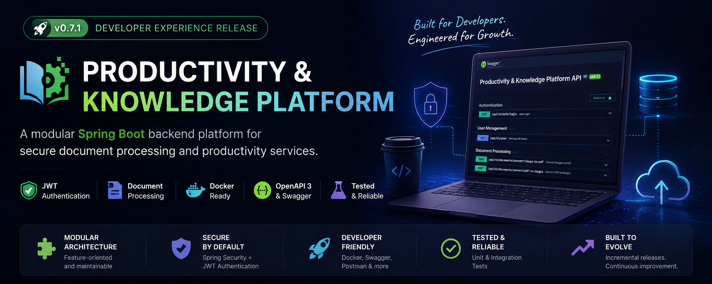
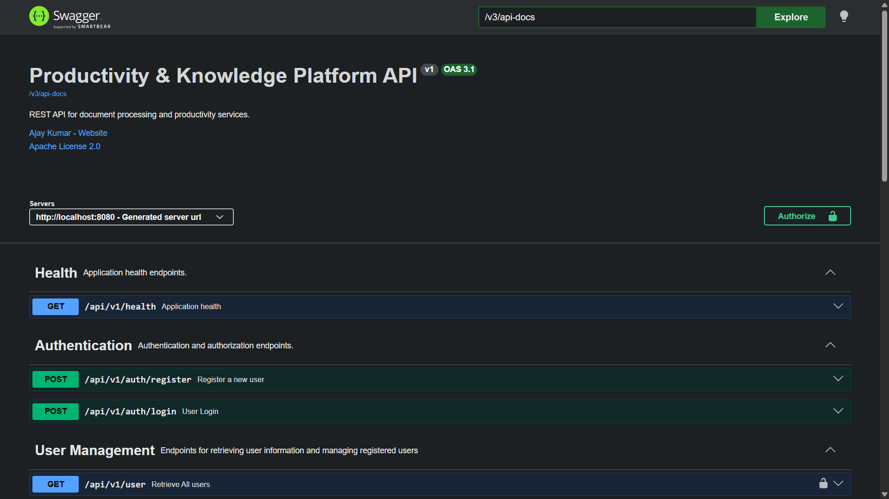
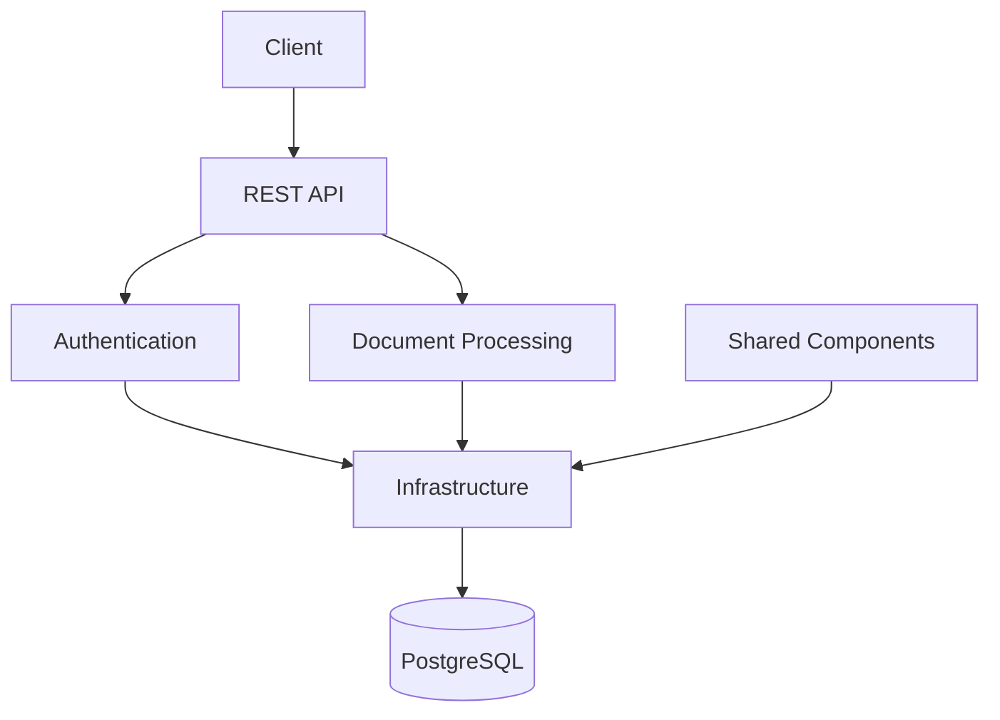

<p align="center">
  
</p>

<h1 align="center">Productivity & Knowledge Platform</h1>

<p align="center">
A modular Spring Boot backend platform for secure document processing, designed to demonstrate modern backend engineering practices.</p>

<p align="center">


</p>

<p align="center">

<a href="#why-this-platform">Why?</a> • <a href="#platform-capabilities">Capabilities</a> • <a href="#see-it-in-action">Demo</a> • <a href="#get-running-in-minutes">Quick Start</a> • <a href="#how-the-platform-is-built">Architecture</a> • <a href="#continue-exploring">Documentation</a>

</p>

---

> **Current Release:** `v0.7.1 — Developer Experience`

> **Status:** 🟢 Active Development

---

## Why this Platform?

Most backend portfolio projects stop once the features work.

This project follows a different philosophy: every release improves either **product capabilities** or **engineering quality**. Alongside document-processing features, the repository evolves through better architecture, security, testing, documentation, and developer tooling.

The result is a backend platform that not only demonstrates **what** has been built, but also **how** modern Spring Boot applications are designed, developed, and maintained.

##  Platform Capabilities

Instead of focusing on a single feature, this project is designed as an evolving backend platform. Each release expands either the platform's capabilities or its engineering quality.

|     🔐 Authentication    |  📄 Document Processing |
| :----------------------: | :---------------------: |
|    JWT Authentication    |       Image → PDF       |
| Role-based Authorization |       PDF → Images      |
|    Stateless Security    | ZIP Streaming Downloads |
|      Spring Security     |     File Validation     |

|  🛠 Developer Experience  |    🏗 Engineering Practices    |
| :-----------------------: | :----------------------------: |
|  Docker & Docker Compose  |      Layered Architecture      |
|         Swagger UI        |      DTO-based API Design      |
|         OpenAPI 3         | Centralized Exception Handling |
|     Postman Collection    |   Unit & Integration Testing   |
| Environment Configuration |    Modular Project Structure   |

---

## 📸 See It in Action

The platform is designed to be easy to explore, easy to run, and easy to extend. Below are a few snapshots of the current developer experience.

---

##  Interactive API Documentation

Explore and test every endpoint directly from the browser using **Swagger UI**.

**Highlights**

* Interactive OpenAPI documentation
* JWT authentication support
* Request/response examples
* Instant API exploration

> 📷 *Screenshot: Swagger UI homepage with Authorize button visible.*
> 
>

---

##  Current Utilities

- Image → PDF
- PDF → Images 

---

##  Dockerized Development

Start the complete development environment with a single command.
```bash
docker compose up --build
```

---

## Developer Experience

The platform emphasizes a smooth development workflow.

* Interactive API documentation
* One-command local setup
* Environment-based configuration
* Ready-to-use Postman collection
* Consistent development environment with Docker

Rather than spending time configuring the project, developers can start exploring the APIs within minutes.

---

## ⚡ Get Running in Minutes

The fastest way to explore the platform is through Docker Compose.

### 1. Clone the repository

```bash
git clone https://github.com/Timely-Position463/productivity-platform.git
cd productivity-platform
```

---

### 2. Configure your environment

Copy the example configuration.

```bash
cp .env.example .env
```

Update the values if required.

---

### 3. Start the platform

```bash
docker compose up --build
```

Docker will automatically start:

* Spring Boot Application
* PostgreSQL Database

---

### 4. Open Swagger

```
http://localhost:8080/swagger-ui/index.html
```

Authorize using a JWT token and start exploring the APIs.

---

### 5. You're ready 

No additional database setup.

No manual dependency installation.

No local PostgreSQL configuration.

Clone → Run → Explore.


## How the Platform Is Built

The project follows a **feature-oriented modular monolith** architecture, where each module owns a specific business capability while sharing common infrastructure.

This approach keeps the codebase easy to understand today while allowing new capabilities to be introduced without unnecessary complexity.



### Architecture Principles

* **Feature-first organization** instead of package-first organization.
* **Clear separation of responsibilities** between controllers, services, repositories, and shared components.
* **Stateless authentication** using JWT and Spring Security.
* **Environment-based configuration** for reproducible local development.
* **Incremental evolution**, where every release strengthens either platform capabilities or engineering quality.

For a detailed explanation of the architecture and design decisions, see the documentation in `project_docs/`.


## Continue Exploring

The README provides a high-level overview of the platform. For architecture decisions, engineering practices, and project planning, explore the documentation below.

- **[Project Specification](/project_docs/01_PROJECT_SPECIFICATION.md)** - Vision and scope of the platform.

- **[Architecture](/project_docs/02_ARCHITECTURE.md)** - Module organization and design decisions.

- **[Engineering Playbook](/project_docs/05_ENGINEERING_PLAYBOOK.md)** - Development workflow and engineering standards.

- **[Decision Log](/project_docs/03_DECISION_LOG.md)** - Important architectural decisions and trade-offs.

- **[Roadmap](/project_docs/04_ROADMAP.md)** - Upcoming platform capabilities and milestones.

- **[Contributing Guide](/project_docs/06_CONTRIBUTING.md)**  - How to contribute to the project.

- **[Changelog](/project_docs/CHANGELOG.md)** - Release history and version highlights.
> The documentation evolves alongside the project, ensuring that implementation details, architectural decisions, and future plans remain easy to discover without overwhelming the README.

## Platform Evolution

This platform is developed through **incremental releases**, where each version focuses on a well-defined engineering outcome rather than accumulating unrelated features.

| Release    | Focus                  | Outcome                                                                                                                       |
| ---------- | ---------------------- | ----------------------------------------------------------------------------------------------------------------------------- |
| **v0.6.0** | Document Processing I  | Introduced the first document utility with Image → PDF conversion and established the project foundation.                     |
| **v0.7.0** | Document Processing II | Expanded document capabilities with PDF → Images while improving the testing strategy and API quality.                        |
| **v0.7.1** | Developer Experience   | Simplified onboarding with Docker, Docker Compose, OpenAPI/Swagger, Postman collections, and environment-based configuration. |

### Current Direction

The next milestone focuses on expanding the platform's document processing capabilities while preserving the engineering standards established in previous releases.

Planned areas include:

* PDF Merge
* PDF Split
* OCR Integration
* AI-assisted document features
* Knowledge management capabilities

> The project follows a release philosophy where **feature releases** expand platform capabilities and **engineering releases** strengthen architecture, maintainability, testing, documentation, and developer experience.

---

## Contributing

Contributions, suggestions, and discussions are welcome. If you'd like to contribute, please review the documentation in `project_docs/` before opening an issue or pull request.

---

## License

This project is licensed under the **MIT License**.

<p align="center">

Built with ❤️ using Spring Boot, PostgreSQL, Docker, and OpenAPI.

</p>
